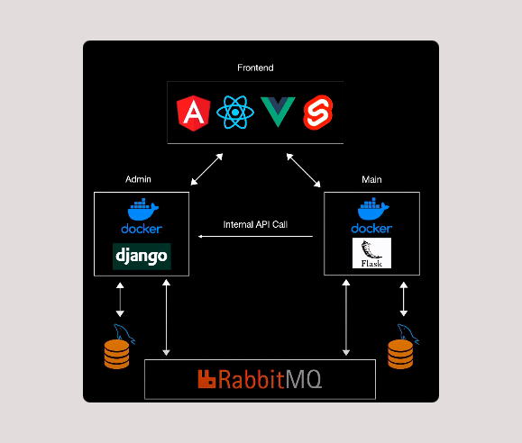
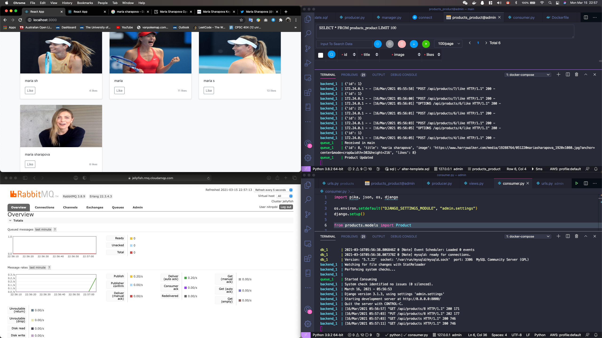
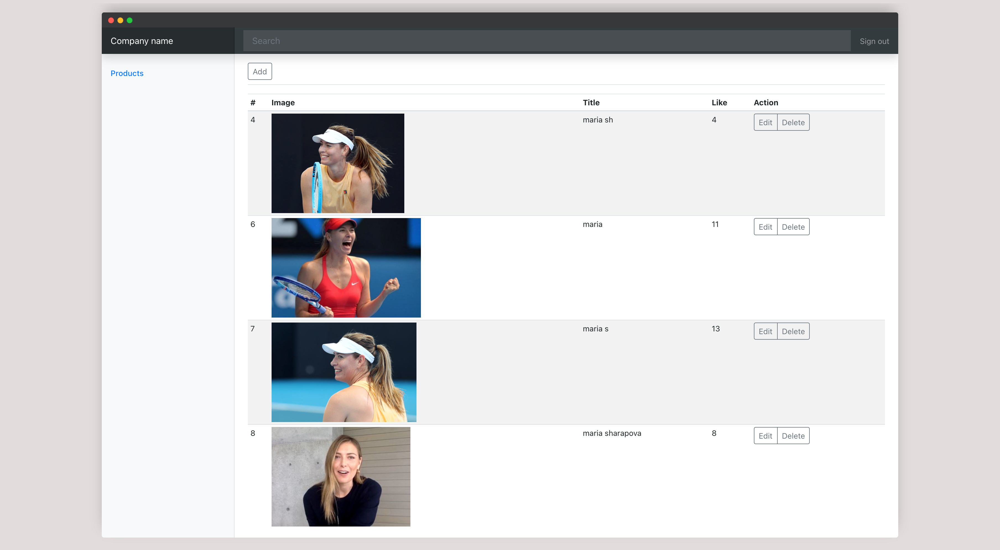
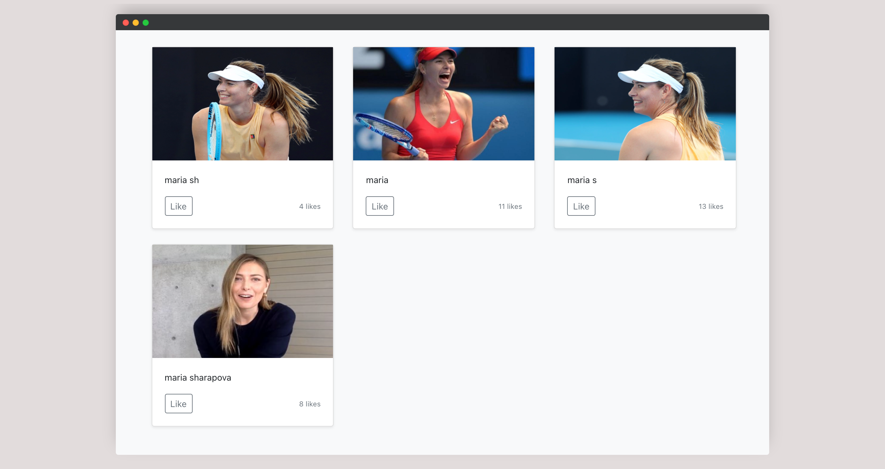

# Photopify

### Python Microservice Web App (with React, Django, Flask, and more)
[Back-end repo](https://github.com/mjdfx073131/photopify-backend)

[Front-end repo](https://github.com/mjdfx073131/photopify-frontend)

## What are Microservices?

According to James Lewis and Martin Fowler:

> Microservice or the microservice architectural style is an approach to developing a single application as a suite of small services, each running in its own process and communicating with lightweight mechanisms, often an HTTP resource API.

To start explaining the microservices style, let's talk a little bit about monolithic systems. A monolithic application is build as a single, autonomous unit. It will affect the entire system if a major change is made. Microservices, however, solve this challenge by being as modular as possible. To be more concise, they help build an application as a suite of small services, each running in its own process and are independently deployable.

## How Photopify works

Admin server is implemented by [Django](https://www.djangoproject.com)
User server is implemented by [Flask](https://flask.palletsprojects.com/en/1.1.x/)
They are both dockerized and communicate with each other asynchronously through [RabbitMQ](https://www.rabbitmq.com)  
Front end is using React framework

## Features

- Admin
  - CRUD 
  - can view all images

- User
  - can like images 

